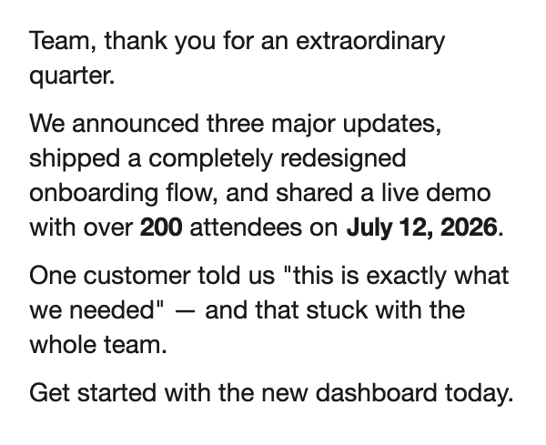

# animate-your-email

Paste text, pick what should stand out, get an animated GIF for your email. However much
text you paste, it lands in **one frame** — there is no pagination and nothing is cut.

**[Live demo →](https://qalipso.github.io/animate-your-email/)** · everything runs in the
browser: no backend, no accounts, no upload.



More output, with measurements, in [`samples/`](samples/README.md) — regenerated from the
real app by `npm run samples`, never hand-edited.

## What it does

Paste up to 1500 characters; the preview rebuilds as you type. Deterministic detection (no
LLM) picks what is worth animating — markup you wrote (`*soft*`, `[[primary]]`), quotes,
numbers and dates, proper nouns, the closing sentence, common CTAs — capped at 15% of the
text and 5 phrases so the result stays readable. Click any word to toggle it; drag across a
phrase to choose one of 10 effects.

**The base text is fully visible in every frame, from the first to the last.** Only the
effect layer around an emphasized phrase animates. Nothing fades in, blurs, or types itself
out, because a reader who sees the GIF for one second should still be able to read it.

### Fitting, not paginating

The frame grows taller to fit the text (up to 1000px); only when it hits that ceiling does
the type step down, and never below 16px. Text that still will not fit is cut at a line
boundary **and the app says so** — it never renders lines off-frame and calls the image
complete.

### Honest export

The Async Clipboard API does not accept `image/gif` in Chromium
(`ClipboardItem.supports('image/gif') === false`). So the app probes the browser on load and
labels its buttons for what they will really do: where an animated copy is impossible,
**Save GIF** becomes the primary action, the secondary one says *Copy still image*, and the
limitation is stated **before** the click rather than explained in a status message after it.

## Output quality

| | |
|---|---|
| Rendering | 2× supersampled, box-filtered to output size |
| Palette | one shared 255-colour palette for the whole animation |
| Encoding | inter-frame differencing via a reserved transparent index |
| Timing | true 20fps — a whole-centisecond 50ms delay, so playback matches the rendered clock |
| Size | 24–135 KB across the samples; 240 KB at the 1500-character cap |

Verified by decoding the produced GIF with `ImageDecoder` and comparing frames against a
fresh reference render: exact frame count, every delay 50000µs, max per-channel difference
≤ 21 (pure quantization), zero pixels differing by more than 40. Details and the before/after
numbers: [`DEC-011`](knowledge/decisions/DEC-011-output-quality-and-one-frame.md).

## Architecture

React + plain Canvas2D/OffscreenCanvas + [`gifenc`](https://github.com/mattdesl/gifenc) in a
Web Worker. A JSON document model (`app/src/engine/model.ts`) is the single source of truth,
and **one** rendering function serves both the live preview and the export — the two cannot
drift, which is what caused the bugs in
[`DEC-007`](knowledge/decisions/DEC-007-retina-canvas-export-bug.md) and
[`DEC-008`](knowledge/decisions/DEC-008-stagger-timing-bug.md). No canvas library.

```
app/             the Vite app (source in app/src, engine in app/src/engine)
app/e2e/         Playwright specs — drive the built app, inspect the file it produced
samples/         generated output + measurements (npm run samples)
knowledge/       decision records (DEC-001…011) and project memory
spike/           archived clipboard investigation that produced DEC-002 / DEC-004
docs/ROADMAP.md  what production readiness would still require
```

## Develop

```bash
cd app && npm install && npm run dev
```

| Command | What it checks |
|---|---|
| `npm run lint` | oxlint |
| `npm run typecheck` | `tsc -b` |
| `npm run test:unit` | 22 Vitest tests — layout, fitting, spacing, highlight geometry, GIF timing |
| `npm run test:e2e` | 9 Playwright tests against the production build |
| `npm run samples` | regenerates `samples/` from the real app |

CI runs lint, types, unit tests and the browser suite on every push
([`ci.yml`](.github/workflows/ci.yml)); `main` deploys to GitHub Pages
([`deploy.yml`](.github/workflows/deploy.yml)).

There is also a `/debug/presets` route that renders every emphasis and transition preset
against short/multiline/Cyrillic/emoji samples for visual QA.

## Status

Portfolio-grade and honest about its limits. What full production use would still require —
proven Gmail/Outlook rendering, an accessibility pass, protection against losing typed text,
export telemetry, and a real browser/email compatibility matrix — is written down in
[`docs/ROADMAP.md`](docs/ROADMAP.md) rather than implied.

Architecture and verification history:
[`DEC-009`](knowledge/decisions/DEC-009-v2-long-form-architecture.md),
[`DEC-010`](knowledge/decisions/DEC-010-simplify-ui-and-always-visible-text.md),
[`DEC-011`](knowledge/decisions/DEC-011-output-quality-and-one-frame.md).

---

Part of the [AI Portal](../README.md). Project memory and decisions live in `knowledge/`;
see [CLAUDE.md](CLAUDE.md) for how they are wired.
